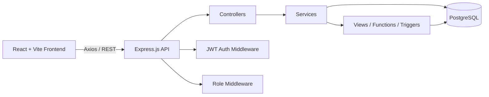
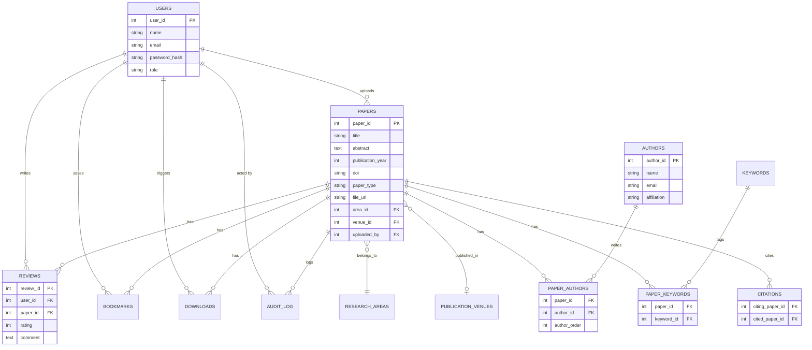

<div align="center">


[](https://git.io/typing-svg)


</div>

## About

**ResearchSphere** is a full-stack research paper repository and discovery platform — built as a 3rd-year Computer Engineering DBMS + Full-Stack project. It's designed to demonstrate real relational database design (not a toy CRUD app): 13 normalized tables, views, stored functions, triggers, and audit logging, all backing a production-style REST API and React frontend.

> The database is the source of truth for this project — every feature below is backed by real SQL, not client-side mock data.

## Table of Contents

- [Features](#features)
- [Tech Stack](#tech-stack)
- [Architecture](#architecture)
- [Database Design](#database-design)
- [Getting Started](#getting-started)
- [API Reference](#api-reference)
- [Roles & Permissions](#roles--permissions)
- [Project Structure](#project-structure)
- [Known Limitations](#known-limitations)
- [License](#license)

## Features

🔍 **Discovery & Search** — full-text-style search across title/abstract/DOI, filterable by research area, year, and paper type

📚 **Citation Network** — citations, cited-by, and citation statistics per paper

🧠 **Related Papers Engine** — dynamically scored recommendations (shared area / keywords / authors), computed via CTEs — not a static table

👥 **Author Collaboration Graph** — discover co-authors and shared publication history

⭐ **Reviews & Ratings** — 1–5 star reviews with one-review-per-user enforcement at the database level

🔖 **Bookmarks & Download Tracking** — personal library + download-event analytics

📤 **Paper Submission** — real PDF upload (multer), with author and keyword tagging on the many-to-many `paper_authors` / `paper_keywords` tables

📊 **Analytics Dashboard** — publication trends, author productivity, research-area breakdowns, all computed from PostgreSQL views

🏆 **Impact Score** — an application-defined indicator (`citations × 5 + downloads × 2 + bookmarks × 3 + avg_rating × 2`) computed by a Postgres function — *not* a claimed academic metric

🔐 **JWT Auth + RBAC** — four roles (`STUDENT`, `RESEARCHER`, `FACULTY`, `ADMIN`) with route-level and ownership-level authorization

🕵️ **Audit Logging** — every paper INSERT/UPDATE/DELETE is trailed via a PostgreSQL trigger into `audit_log`, browsable from the Admin dashboard

## Tech Stack

| Layer | Technology |
|---|---|
| Database | PostgreSQL 18.6 |
| Backend | Node.js · Express.js · `pg` · JWT · bcryptjs · multer |
| Frontend | React · Vite · JavaScript (no TypeScript) |
| Auth | JSON Web Tokens, role-based middleware |

## Architecture



The frontend never talks to PostgreSQL directly — every request flows through the Express API, which enforces authentication and role checks before any query runs.

## Database Design

13 tables, fully normalized, with composite keys, `CHECK` constraints, and `ON DELETE` behavior tuned per relationship (e.g. `audit_log.paper_id` uses `ON DELETE SET NULL` so history survives a deleted paper).



**Also included:** 4 views (`paper_statistics`, `author_productivity`, `research_area_statistics`, `paper_discovery_summary`), 2 stored functions (`calculate_paper_impact`, `search_papers`), a `BEFORE DELETE` audit trigger, and 8 explicit indexes on top of the PK/unique-constraint indexes Postgres creates automatically.

## Getting Started

### Prerequisites
- Node.js 18+
- PostgreSQL 16+
- npm

### 1. Clone & set up the database
```bash
git clone https://github.com/shrutip04/research-paper-repository.git
cd research-paper-repository

createdb research_repository

psql -d research_repository -f database/01_schema.sql
psql -d research_repository -f database/02_sample_data.sql
psql -d research_repository -f database/04_views.sql
psql -d research_repository -f database/05_functions.sql
psql -d research_repository -f database/06_triggers.sql
psql -d research_repository -f database/07_indexes.sql
```

### 2. Backend
```bash
cd backend
npm install
```
Create `backend/.env`:
```env
PORT=5000
DB_HOST=localhost
DB_PORT=5432
DB_NAME=research_repository
DB_USER=postgres
DB_PASSWORD=your_local_postgres_password
JWT_SECRET=your_local_secret
```
```bash
npm run start
```

### 3. Frontend
```bash
cd frontend
npm install
npm run dev
```

Visit `http://localhost:5173`.

## API Reference

<details>
<summary><strong>Auth</strong></summary>

| Method | Endpoint | Description |
|---|---|---|
| POST | `/api/auth/register` | Register (STUDENT / RESEARCHER / FACULTY only) |
| POST | `/api/auth/login` | Log in, returns JWT |
| GET | `/api/auth/me` | Current user from token |

</details>

<details>
<summary><strong>Papers</strong></summary>

| Method | Endpoint | Auth | Description |
|---|---|---|---|
| GET | `/api/papers` | — | List papers (filterable) |
| GET | `/api/papers/search?q=` | — | Search title/abstract/DOI |
| GET | `/api/papers/:id` | — | Paper detail |
| POST | `/api/papers` | Researcher/Faculty/Admin | Create paper (multipart, PDF upload) |
| PUT | `/api/papers/:id` | Uploader/Admin | Update paper |
| DELETE | `/api/papers/:id` | Admin | Delete paper |
| POST | `/api/papers/:id/authors` | Uploader/Admin | Attach authors |
| POST | `/api/papers/:id/keywords` | Uploader/Admin | Attach keywords |
| GET | `/api/papers/:id/related` | — | Related-papers heuristic |
| GET | `/api/papers/:id/impact` | — | Impact score |

</details>

<details>
<summary><strong>Citations, Authors, Areas, Keywords, Venues</strong></summary>

| Method | Endpoint | Description |
|---|---|---|
| GET | `/api/papers/:id/citations` \| `/cited-by` \| `/citation-stats` | Citation network |
| GET | `/api/authors` \| `/api/authors/:id` | Author directory |
| GET | `/api/authors/:id/papers` \| `/collaborations` | Author's papers / co-authors |
| POST | `/api/authors` | Add a new author (used by paper submission) |
| GET | `/api/areas` \| `/api/areas/:id/papers` | Research areas |
| GET | `/api/keywords` \| `/api/keywords/:id/papers` | Keywords |
| GET | `/api/venues` | Publication venues |

</details>

<details>
<summary><strong>Reviews, Bookmarks, Downloads</strong></summary>

| Method | Endpoint | Auth | Description |
|---|---|---|---|
| GET | `/api/papers/:id/reviews` | — | Reviews for a paper |
| POST | `/api/papers/:id/reviews` | Required | Submit a review (one per user per paper) |
| PUT | `/api/reviews/:id` | Owner | Edit your review |
| GET | `/api/reviews/me` | Required | Your own reviews |
| POST/DELETE | `/api/papers/:id/bookmark` | Required | Bookmark toggle |
| GET | `/api/users/:id/bookmarks` | Self/Admin | A user's bookmarks |
| POST | `/api/papers/:id/download` | Required | Log a download event |

</details>

<details>
<summary><strong>Analytics & Admin</strong></summary>

| Method | Endpoint | Auth | Description |
|---|---|---|---|
| GET | `/api/analytics/papers` \| `/authors` \| `/areas` \| `/trends` | — | Dashboard analytics |
| GET | `/api/admin/stats` | Admin | System-wide stats |
| GET | `/api/admin/users` | Admin | User list |
| GET | `/api/admin/audit-logs` | Admin | Paper change history |

</details>

## Roles & Permissions

| Action | Student | Researcher | Faculty | Admin |
|---|:---:|:---:|:---:|:---:|
| Browse, search, bookmark, review | ✅ | ✅ | ✅ | ✅ |
| Submit a paper | ❌ | ✅ | ✅ | ✅ |
| Edit own paper | ❌ | ✅ | ✅ | ✅ |
| Delete any paper | ❌ | ❌ | ❌ | ✅ |
| View admin dashboard / audit log | ❌ | ❌ | ❌ | ✅ |

## Project Structure

```
research-paper-repository/
├── database/        # schema, seed data, views, functions, triggers, indexes
├── backend/
│   └── src/
│       ├── config/       # db connection, multer upload config
│       ├── controllers/
│       ├── services/     # all SQL lives here
│       ├── routes/
│       └── middleware/   # JWT auth, role-based authorization
├── frontend/
│   └── src/
│       ├── pages/
│       ├── components/
│       ├── reactbits/    # sourced UI components (Aurora, ShinyText, CountUp, SpotlightCard)
│       ├── layouts/
│       └── services/     # axios instance
└── docs/             # ER diagram, report, screenshots
```

## Known Limitations

- The **Related Papers** score and **Impact Score** are application-defined heuristics for this project, not peer-reviewed or scientifically validated metrics.
- Full-text search currently uses `ILIKE` pattern matching rather than PostgreSQL's native `tsvector`/`GIN`-indexed full-text search.
- No email verification on registration.

## License

MIT — built for academic coursework.

<div align="center">

Built by **Shruti Pawar** · Computer Engineering, SNDT Women's University (Usha Mittal Institute of Technology), Mumbai

<picture>
  <source media="(prefers-color-scheme: dark)" srcset="https://readme-typing-svg.demolab.com/?font=Fira+Code&weight=500&size=16&pause=1500&color=AAB2C4&center=true&vCenter=true&width=520&height=25&lines=Built+for+DBMS+%2B+Full-Stack+Coursework;Thanks+for+visiting+this+repo">